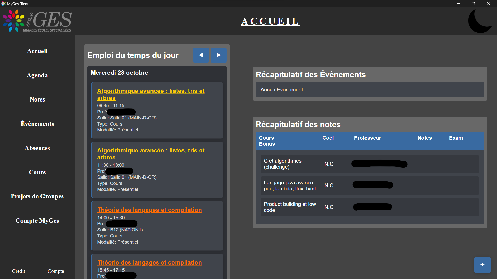

# PRESENTATION

## ⚠️ Disclaimer ⚠️ (⛔🛑)
Ce logiciel utilise l'API Scholae pour se connecter aux services MyGes (voir [MyGesApis](https://github.com/Spatulox/MyGesApis)). 
Certaines fonctionnalités (téléchargements des fichiers) peuvent dont casser car elles ne se bases pas sur cette API

## Fonctionnalités

[MyGes Client](https://github.com/Spatulox/MyGesClient) vous permet de **visualiser votre agenda**, vos **notes**, vos **absences** ainsi que toutes les informations utiles. 
De plus, plus besoin de connexion internet ! Ce logiciel utilise SQLite afin de stocker localement vos données, permettant ainsi un accès rapide à vos informations !
Ne vous inquiétez pas de potentielles fausse informations, les données locales sont très souvent synchronisées avec MyGes !

__Menu Principal__

## Futur Ajouts
> - Button to hard refresh schedule
> - Changer de place les déconnexion/modifier le mot de passe / supprimer les anciennes données ?? (mettre ça dans softwareAccount ?)
> - Faire les absences (Local DB WELP)
> - Software Account page
> - Projet de groupe :
>  - Listes des projets
>  - Si on n'est pas dans un groupe, show tous les groupes dispo
>  - Si on est dans un groupe, on voit notre groupe avec les données utile (Type, etc...)
> `Impossible de télécharger les fichiers d'un groupe, Impossible d'upload des fichiers sur le groupe :/`

# How to run the code

This code use the official [Wails](https://wails.io/) Vanilla template.

## Live Development

To run in live development mode, run `wails dev` in the project directory. This will run a Vite development
server that will provide very fast hot reload of your frontend changes. If you want to develop in a browser
and have access to your Go methods, there is also a dev server that runs on http://localhost:34115. Connect
to this in your browser, and you can call your Go code from devtools.

## Building

To build a redistributable, production mode package, use `wails build`.
