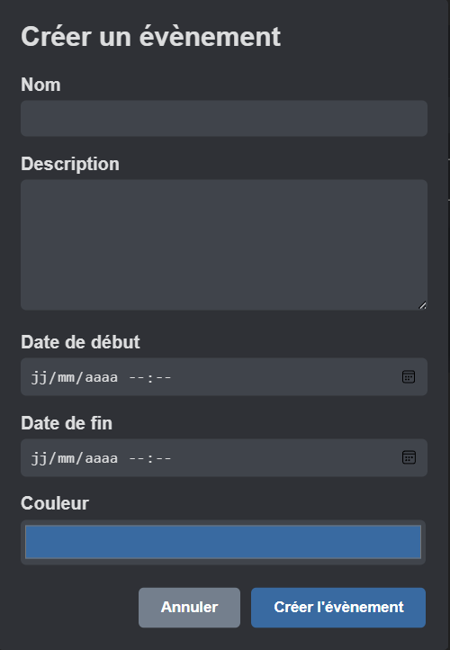

# MyGes Client
[MyGes Client](https://github.com/Spatulox/MyGesClient) est un logiciel qui vous permet d'accéder facilement à vos informations MyGes, même hors ligne.

## ⚠️ Disclaimer ⚠️ (⛔🛑)
Ce logiciel utilise l'API Scholae pour se connecter aux services MyGes (voir [MyGesApis](https://github.com/Spatulox/MyGesApis)). 
Certaines fonctionnalités (téléchargements des fichiers) peuvent donc casser car elles ne se bases pas sur cette API

## Fonctionnalités Principales
MyGesClient vous offre une vue d'ensemble de votre vie étudiante :
- Visualisation de l'agenda : Consultez vos emplois du temps passés, présents et futurs
- Suivi des notes : Accédez à vos résultats par semestre
- Gestion des absences : Gardez un œil sur vos présences et absences
- Informations du compte : Visualisez les données de votre profil MyGes

## Avantages clés
- Accès hors ligne : Grâce à SQLite, vos données sont stockées localement pour un accès rapide
- Synchronisation régulière : Mise à jour fréquente avec MyGes pour des informations précises
- Support multi-comptes : Gérez plusieurs profils MyGes dans une seule application 

 

## Fonctionnalités avancées
- Menu intuitif : Navigation simplifiée à travers l'application
- Tableau de bord récapitulatif : Vue d'ensemble de vos informations importantes
- Gestion d'événements locaux : Ajoutez vos propres rappels pour les contrôles, rendus, etc.
- Projets de groupe : Visualisez et gérez vos projets pédagogiques MyGes
    - Rejoignez ou quittez des groupes
    - Consultez les informations des projets
 

## Aperçu de l'interface
__Menu Principal__

__Évènements__ 

## Futur Ajouts
> - Button to hard refresh schedule
> - Gestion des évènements (modifier / supprimer)
> - Changer de place les déconnexion/modifier le mot de passe / supprimer les anciennes données ?? (mettre ça dans softwareAccount ?)
> - Faire les absences (Local DB WELP)
> - Software Account page
> - Projet de groupe :
>  - Listes des projets ✅
>  - Si on n'est pas dans un groupe, show tous les groupes dispo
>  - Si on est dans un groupe, on voit notre groupe avec les données utile (Type, etc...) ✅ 
> `Impossible de télécharger les fichiers d'un groupe, Impossible d'upload des fichiers sur le groupe :/`

Découvrez MyGesClient pour une gestion optimisée de votre parcours étudiant !

# How to run the code

This code use the official [Wails](https://wails.io/) Vanilla template.

## Live Development

To run in live development mode, run `wails dev` in the project directory. This will run a Vite development
server that will provide very fast hot reload of your frontend changes. If you want to develop in a browser
and have access to your Go methods, there is also a dev server that runs on http://localhost:34115. Connect
to this in your browser, and you can call your Go code from devtools.

## Building

To build a redistributable, production mode package, use `wails build`.
